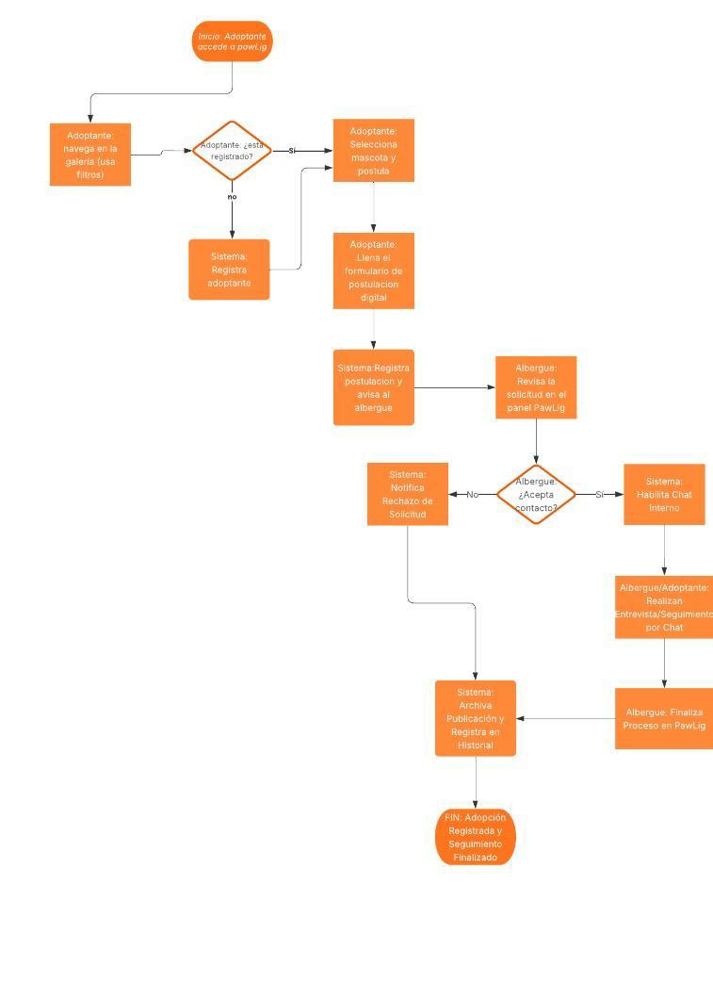

# MAPA DE PROCESOS

## Índice

1. Adopción de mascotas
   &nbsp;&nbsp;&nbsp;&nbsp;AS-IS (Cómo es ahora – sin el sistema)
   &nbsp;&nbsp;&nbsp;&nbsp;TO-BE (Cómo será – con el sistema)
2. Gestión de inventarios y ventas de productos
   &nbsp;&nbsp;&nbsp;&nbsp;AS-IS (Cómo es ahora – sin el sistema)
   &nbsp;&nbsp;&nbsp;&nbsp;TO-BE (Cómo será – con el sistema)
3. Comunicación y seguimiento post-adopción
   &nbsp;&nbsp;&nbsp;&nbsp;AS-IS (Cómo es ahora – sin el sistema)
   &nbsp;&nbsp;&nbsp;&nbsp;TO-BE (Cómo será – con el sistema)
4. Comparaciones
   &nbsp;&nbsp;&nbsp;&nbsp;AS-IS (Cómo es ahora – sin el sistema)
   &nbsp;&nbsp;&nbsp;&nbsp;TO-BE (Cómo será – con el sistema)
5. Indicadores de éxito
   &nbsp;&nbsp;&nbsp;&nbsp;AS-IS (Cómo es ahora – sin el sistema)
   &nbsp;&nbsp;&nbsp;&nbsp;TO-BE (Cómo será – con el sistema)
6. Diagrama de flujo general

---

## 1. Adopción de mascotas

### AS-IS (Cómo es ahora – sin el sistema)

**Descripción**  
Los albergues del Valle de Aburrá gestionan las adopciones de forma manual y descentralizada. Utilizan redes sociales, llamadas telefónicas y correos electrónicos para publicar mascotas disponibles. Los adoptantes potenciales deben contactar individualmente a cada albergue, llenar formularios físicos o digitales no estandarizados, y coordinar visitas presenciales. El seguimiento del estado de las solicitudes se realiza mediante comunicación directa, sin un sistema centralizado de _tracking_.

**Diagrama de flujo del proceso actual**  
Albergue publica mascota → Redes sociales/Email → Adoptante contacta albergue → Formulario manual → Entrevista telefónica → Visita presencial → Aprobación/rechazo manual → Seguimiento no sistematizado

**Problemas identificados**

- Falta de visibilidad centralizada de mascotas disponibles en el Valle de Aburrá.
- Proceso de postulación lento y no estandarizado entre albergues.
- Seguimiento manual de solicitudes, con alta probabilidad de pérdida de información.

**Tiempos actuales**  
Aproximadamente entre **15 y 30 días** por proceso de adopción de cada animal.

**Recursos utilizados**  
Personal administrativo de albergues, redes sociales, correo electrónico, teléfono.

**Cuellos de botella**  
Coordinación de visitas, verificación manual de información, comunicación asincrónica.

---

### TO-BE (Cómo será – con el sistema)

**Descripción**  
PawLig centraliza todo el proceso de adopción en una plataforma web unificada. Los albergues publican mascotas con información estandarizada y fotos. Los adoptantes pueden buscar, filtrar y postularse en línea. El sistema automatiza el flujo de trabajo: postulación → revisión → entrevista vía chat → aprobación → seguimiento. Todos los estados son visibles en tiempo real para adoptantes y albergues.

**Diagrama de flujo del proceso mejorado**  
Albergue publica en PawLig → Adoptante busca/filtra → Postulación en línea → Revisión por albergue → Chat integrado → Actualización estado → Adopción completada → Seguimiento automatizado

**Mejoras implementadas**

- Centralización de mascotas disponibles en el Valle de Aburrá con filtros avanzados.
- Postulación estandarizada y seguimiento automatizado de estados.
- Sistema de comunicación integrado para entrevistas y coordinación.

**Tiempos esperados**  
**5–10 días** por proceso de adopción (_reducción del 60%_).

**Automatizaciones incluidas**  
Notificaciones por email, actualización de estados, recordatorios.

**Beneficios cuantificables**

- **10% aumento** en adopciones efectivas.
- **70% reducción** en tiempo de gestión para albergues.

---

## 2. Gestión de inventarios y ventas de productos

### AS-IS (Cómo es ahora – sin el sistema)

**Descripción**  
Los proveedores de productos para mascotas gestionan inventarios de forma manual con hojas de cálculo o sistemas independientes. Las ventas se realizan mediante tiendas físicas, redes sociales o plataformas genéricas de comercio electrónico. No existe un canal especializado que conecte específicamente a adoptantes con productos para mascotas recién adoptadas. La coordinación de pedidos y actualización de stock se realiza manualmente.

**Diagrama de flujo del proceso actual**  
Control inventario manual → Publicación en múltiples canales → Pedidos dispersos → Coordinación manual → Actualización stock manual → Facturación independiente

**Problemas identificados**

- Inventario desactualizado entre diferentes canales de venta.
- Falta de especialización en productos para mascotas recién adoptadas.
- Proceso de pedido fragmentado sin integración con perfil de adoptante.

**Tiempos actuales**  
**2–3 días** para procesar pedido completo.

**Recursos utilizados**  
Hojas de cálculo, múltiples plataformas de venta, comunicación manual.

**Cuellos de botella**  
Sincronización de inventario, procesamiento manual de pedidos, falta de automatización.

---

### TO-BE (Cómo será – con el sistema)

**Descripción**  
PawLig integra un módulo de gestión de inventario especializado para proveedores de productos para mascotas. Los vendedores mantienen stock centralizado que se actualiza automáticamente con cada pedido simulado. El sistema sugiere productos relevantes basados en el perfil de la mascota adoptada. Los adoptantes pueden simular compras completas con generación automática de órdenes.

**Diagrama de flujo del proceso futuro**  
Gestión centralizada de inventario → Catálogo especializado → Carrito de compras → Checkout simulado → Orden automática → Actualización stock automática → Notificación a proveedor → Seguimiento de estado

**Mejoras implementadas**

- Inventario centralizado y actualizado en tiempo real.
- Carrito de compras integrado con simulación de _checkout_.
- Sugerencias automatizadas basadas en perfil de mascota adoptada.

**Tiempos esperados**  
**1 día** para procesar pedido (_reducción del 60%_).

**Automatizaciones incluidas**  
Actualización de stock, generación de órdenes, notificaciones, sugerencias personalizadas.

**Beneficios cuantificables**

- **15% reducción** en costos de adquisición para adoptantes.
- **50% reducción** en errores de inventario.

---

## 3. Comunicación y seguimiento post-adopción

### AS-IS (Cómo es ahora – sin el sistema)

**Descripción**  
La comunicación entre albergues y adoptantes post-adopción es esporádica y no estructurada. Se realiza principalmente mediante llamadas telefónicas, mensajes de texto o redes sociales. No existe un historial centralizado de conversaciones ni un sistema de seguimiento estandarizado. Los albergues pierden visibilidad sobre el bienestar de las mascotas adoptadas y los adoptantes carecen de canal formal para consultas.

**Diagrama de flujo del proceso actual**  
Adopción completada → Contacto esporádico → Comunicación dispersa → Sin historial centralizado → Seguimiento no estructurado → Datos perdidos

**Problemas identificados**

- Comunicación fragmentada en múltiples canales sin historial.
- Falta de seguimiento estandarizado del bienestar post-adopción.
- Pérdida de información valiosa para mejorar procesos futuros.

**Tiempos actuales**  
Comunicación reactiva sin tiempos definidos.

**Recursos utilizados**  
Teléfono, WhatsApp, redes sociales, correo electrónico.

**Cuellos de botella**  
Coordinación de comunicación, falta de recordatorios, historial disperso.

---

### TO-BE (Cómo será – con el sistema)

**Descripción del proceso mejorado**  
PawLig implementa un sistema de chat integrado y seguimiento automatizado post-adopción. Todas las comunicaciones se centralizan en hilos conversacionales organizados por mascota. El sistema genera recordatorios automáticos para seguimiento y permite a los albergues monitorear el bienestar de las mascotas adoptadas. Se mantiene un historial completo accesible para ambas partes.

**Diagrama de flujo del proceso futuro**  
Adopción completada → Chat integrado activado → Seguimiento automatizado → Recordatorios programados → Historial centralizado → Reportes de bienestar → Mejora continua basada en datos

**Mejoras implementadas**

- Sistema de chat integrado con historial conservado.
- Seguimiento automatizado con recordatorios programados.
- Centralización de información para análisis y mejora continua.

**Tiempos esperados**  
Comunicación inmediata, seguimiento programado cada **30 días**.

**Automatizaciones incluidas**  
Recordatorios de seguimiento, notificaciones, historial conversacional.

**Beneficios cuantificables**

- **80% mejora** en retención de información.
- **40% aumento** en satisfacción de adoptantes.

---

## 4. Comparaciones

| Aspecto                             | AS-IS      | TO-BE     | Mejora |
| ----------------------------------- | ---------- | --------- | ------ |
| Tiempo de proceso de adopción       | 15–30 días | 5–10 días | –60%   |
| Errores en el inventario            | Alto       | Bajo      | –70%   |
| Personas involucradas en el proceso | 4–6        | 2–3       | –50%   |
| Costo de gestión                    | $ Alto     | $ Bajo    | –40%   |
| Comunicación efectiva               | 40%        | 85%       | +45%   |
| Satisfacción del usuario            | 60%        | 90%       | +30%   |

---

## 5. Indicadores de éxito

**KPI 1: Tasa de adopciones efectivas**

- **Definición**: Porcentaje de mascotas publicadas que logran adopción exitosa.
- **Meta**: 10% de animales registrados adoptados en primer año.
- **Fuente**: Reporte HU-011 – Historial de adopciones.
- **Frecuencia**: Mensual.

**KPI 2: Tiempo promedio de proceso de adopción**

- **Definición**: Días desde publicación hasta adopción completada.
- **Meta**: Reducción de 20 días a 8 días promedio.
- **Fuente**: Dashboard HU-013 – Métricas de tiempo.
- **Frecuencia**: Semanal.

**KPI 3: Tasa de satisfacción de usuarios**

- **Definición**: Porcentaje de usuarios que califican experiencia como satisfactoria.
- **Meta**: 85% de satisfacción general.
- **Fuente**: Encuestas integradas en panel de usuario.
- **Frecuencia**: Trimestral.

**KPI 4: Reducción de Gastos de gestión**

- **Definición**: Disminución porcentual en costos operativos para albergues.
- **Meta**: 15% reducción en costos de gestión.
- **Fuente**: Reportes financieros comparativos.
- **Frecuencia**: Anual.

---

## 6. Diagrama de flujo general

