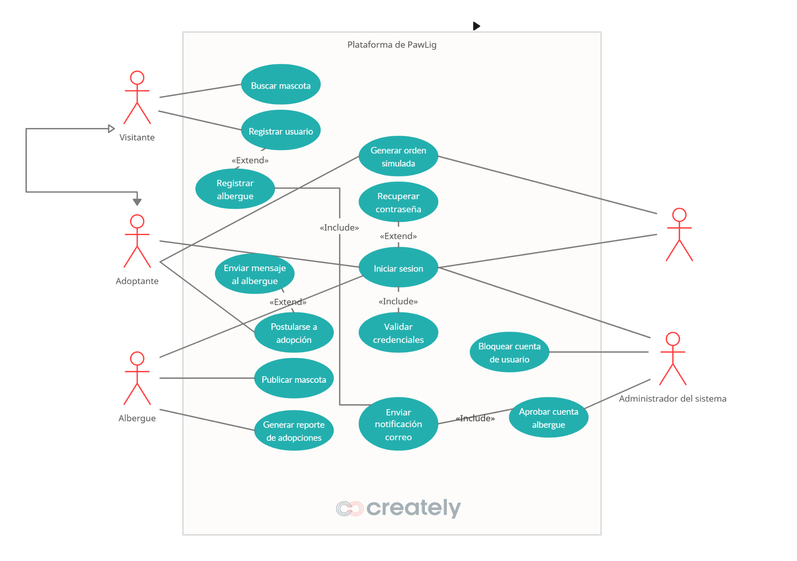

# CASO DE USO Y ESCENARIOS

## Índice

1. Introducción
2. Alcance
3. Lista de actores
4. Casos de uso
5. Diagrama UML

---

## 1. Introducción

El presente documento especifica los casos de uso del sistema **PawLig**, plataforma web integral para la adopción responsable de mascotas y comercio electrónico de productos para animales en el Valle de Aburrá. Este documento tiene como objetivo describir detalladamente las interacciones entre los actores del sistema y las funcionalidades que ofrece la plataforma, garantizando una comprensión clara del comportamiento esperado del software.

Los casos de uso aquí descritos se derivan directamente de los requerimientos funcionales establecidos en el documento de especificación de requerimientos y están alineados con el alcance definido para la versión 1.0 del proyecto PawLig. Este documento servirá como guía para el equipo de desarrollo durante la fase de implementación y como referencia para las pruebas de validación del sistema.

---

## 2. Alcance

Este documento cubre los **10 casos de uso principales** del sistema PawLig, organizados en las siguientes categorías:

- **Autenticación y registro**: 2 casos de uso.
- **Gestión de perfiles**: 1 caso de uso.
- **Funcionalidades principales**: 5 casos de uso.
- **Administración del sistema**: 1 caso de uso.
- **Reportes y consultas**: 1 caso de uso.

El alcance se limita a las funcionalidades definidas en el _Documento de Alcance versión 1.0_, excluyendo integraciones con pasarelas de pago reales, aplicaciones móviles nativas y soporte multilingüe.

---

## 3. Lista de actores

### 3.1. Actores principales

- **Visitante no registrado**: Usuario que accede a la plataforma sin credenciales. Puede buscar y filtrar mascotas, pero no realizar acciones que requieran autenticación.
- **Adoptante registrado**: Usuario con cuenta activa que puede postularse a adopciones, guardar mascotas favoritas, simular compras y utilizar el sistema de chat.
- **Representante de albergue**: Usuario representante de entidad de rescate verificada, con permisos para publicar mascotas, gestionar solicitudes y generar reportes.
- **Vendedor de productos**: Usuario con cuenta especializada para gestionar catálogo de productos, inventario y recibir órdenes de compra simuladas.
- **Administrador del sistema**: Usuario con privilegios completos para gestionar usuarios, aprobar cuentas de albergues y supervisar el funcionamiento general de la plataforma.

### 3.2. Actores secundarios

- **Sistema de autenticación**: Componente interno responsable de validar credenciales y gestionar sesiones.
- **Sistema de notificaciones**: Componente que envía notificaciones por correo electrónico y alertas internas.
- **Sistema de base de datos**: Componente de almacenamiento y recuperación de información.
- **Cloudinary**: Servicio externo para gestión y almacenamiento de imágenes.

---

## 4. Casos de uso

### CU-001: Registrar Nuevo Adoptante

- **Actor principal**: Visitante no registrado
- **Actores secundarios**: Sistema de validación
- **Objetivo**: Crear cuenta de adoptante en la plataforma
- **Precondiciones**: El usuario no debe tener cuenta previa con el mismo email

**Flujo básico**:

1. El usuario accede a la página de registro.
2. El sistema muestra formulario de registro (email, contraseña, datos personales).
3. El usuario ingresa email, contraseña y datos personales completos.
4. El usuario hace clic en "Registrarse".
5. El sistema valida que el email no esté registrado.
6. El sistema valida fortaleza de contraseña (mínimo 8 caracteres).
7. El sistema crea perfil de adoptante.
8. El sistema inicia sesión automáticamente.
9. El sistema redirige a la galería de adopciones.
10. Caso de uso finalizado exitosamente.

**Flujos alternativos**:

- **FA-1: Email ya registrado**  
  En el paso 5, si el email ya existe:
  - El sistema muestra _"Este correo ya está registrado"_.
  - El sistema sugiere recuperación de contraseña.
  - Regresa al paso 2.

**Flujos de excepción**:

- **FE-1: Contraseña débil**  
  En el paso 6, si la contraseña es menor a 8 caracteres:
  - El sistema muestra _"La contraseña debe tener mínimo 8 caracteres"_.
  - Regresa al paso 2.

**Postcondiciones**: Usuario registrado como adoptante, sesión activa iniciada.  
**Frecuencia de uso**: Media  
**Prioridad**: Alta  
**Reglas de negocio asociadas**:

- RN-001: Contraseña mínima 8 caracteres
- RN-002: Email único por usuario

---

### CU-002: Solicitar cuenta de albergue

- **Actor principal**: Representante de albergue
- **Actores secundarios**: Administrador del sistema
- **Objetivo**: Solicitar creación de cuenta especializada para albergue
- **Precondiciones**: El representante debe tener datos válidos de la entidad de rescate

**Flujo básico**:

1. El usuario accede al formulario de solicitud de albergue.
2. El sistema muestra un formulario con campos obligatorios.
3. El usuario ingresa datos del albergue (nombre, ubicación Valle de Aburrá, contacto, documentos).
4. El usuario envía la solicitud.
5. El sistema valida campos obligatorios.
6. El sistema registra cuenta en estado _"Pendiente de aprobación"_.
7. El sistema notifica al administrador.
8. El sistema muestra _"Solicitud enviada, espere aprobación"_.
9. Caso de uso finalizado exitosamente.

**Flujos de excepción**:

- **FE-1: Campos incompletos**  
  En el paso 5, si faltan campos obligatorios:
  - El sistema muestra _"Complete todos los campos obligatorios"_.
  - Regresa al paso 2.

**Postcondiciones**: Cuenta de albergue creada en estado pendiente, notificación enviada a administrador.  
**Frecuencia de uso**: Baja  
**Prioridad**: Alta  
**Reglas de negocio asociadas**:

- RN-003: Albergues deben estar ubicados en Valle de Aburrá
- RN-004: Aprobación requerida por administrador

---

### CU-003: Actualizar perfil de vendedor

- **Actor principal**: Vendedor de productos
- **Actores secundarios**: Sistema de validación
- **Objetivo**: Actualizar información de perfil y tienda
- **Precondiciones**: El vendedor debe tener cuenta activa y aprobada

**Flujo básico**:

1. El vendedor accede a _"Mi Perfil"_ en el panel.
2. El sistema muestra formulario de edición con datos actuales.
3. El vendedor edita información (descripción, contacto, ubicación Valle de Aburrá).
4. El vendedor guarda cambios.
5. El sistema valida campos obligatorios.
6. El sistema actualiza información en base de datos.
7. El sistema muestra _"Cambios guardados exitosamente"_.
8. Caso de uso finalizado exitosamente.

**Flujos de excepción**:

- **FE-1: Ubicación inválida**  
  En el paso 5, si la ubicación no es del Valle de Aburrá:
  - El sistema muestra _"Solo se permiten ubicaciones en el Valle de Aburrá"_.
  - Regresa al paso 2.

**Postcondiciones**: Perfil actualizado, cambios visibles inmediatamente.  
**Frecuencia de uso**: Media  
**Prioridad**: Media  
**Reglas de negocio asociadas**:

- RN-005: Proveedores deben operar en Valle de Aburrá
- RN-006: Campos obligatorios deben completarse

---

### CU-004: Publicar mascota en adopción

- **Actor principal**: Albergue activo
- **Actores secundarios**: Sistema de validación, Cloudinary
- **Objetivo**: Registrar mascota disponible para adopción
- **Precondiciones**: Albergue con cuenta aprobada, mascota con datos completos

**Flujo básico**:

1. El albergue accede a _"Publicar Mascota"_.
2. El sistema muestra formulario con campos obligatorios.
3. El albergue ingresa datos (nombre, especie, descripción, requisitos, ubicación Valle de Aburrá).
4. El albergue sube al menos una foto.
5. El albergue guarda publicación.
6. El sistema valida datos obligatorios y foto.
7. El sistema almacena mascota con estado _"Disponible"_.
8. El sistema hace visible la mascota en galería principal.
9. El sistema muestra _"Mascota publicada exitosamente"_.
10. Caso de uso finalizado exitosamente.

**Flujos de excepción**:

- **FE-1: Formato de imagen inválido**  
  En el paso 6, si la imagen no es JPEG/PNG:
  - El sistema muestra _"Solo se permiten formatos JPEG o PNG"_.
  - Regresa al paso 2.

**Postcondiciones**: Mascota visible en galería, estado _"Disponible"_.  
**Frecuencia de uso**: Media  
**Prioridad**: Alta  
**Reglas de negocio asociadas**:

- RN-007: Mínimo una foto por mascota
- RN-008: Ubicación requerida en Valle de Aburrá

---

### CU-005: Buscar y filtrar mascotas

- **Actor principal**: Adoptante o usuario anónimo
- **Actores secundarios**: Sistema de búsqueda
- **Objetivo**: Encontrar mascotas que cumplan criterios específicos
- **Precondiciones**: Mascotas disponibles en el sistema

**Flujo básico**:

1. El usuario accede a la galería de adopciones.
2. El sistema muestra la lista de mascotas disponibles.
3. El usuario aplica filtros (especie, tamaño, municipio Valle de Aburrá).
4. El usuario ejecuta búsqueda.
5. El sistema consulta la base de datos con criterios.
6. El sistema muestra resultados que cumplen todos los filtros.
7. Caso de uso finalizado exitosamente.

**Flujos alternativos**:

- **FA-1: Sin resultados**  
  En el paso 6, si no hay mascotas que cumplan criterios:
  - El sistema muestra _"No se encontraron resultados"_.
  - El sistema sugiere ampliar criterios de búsqueda.

**Postcondiciones**: Lista filtrada de mascotas mostrada al usuario.  
**Frecuencia de uso**: Alta  
**Prioridad**: Alta  
**Reglas de negocio asociadas**:

- RN-009: Búsqueda debe incluir filtro por municipio
- RN-010: Resultados deben cumplir todos los criterios

---

### CU-006: Postular para adopción

- **Actor principal**: Adoptante registrado
- **Actores secundarios**: Albergue, sistema de notificaciones
- **Objetivo**: Enviar solicitud formal de adopción
- **Precondiciones**: Adoptante con sesión activa, mascota disponible

**Flujo básico**:

1. El adoptante selecciona mascota de interés.
2. El adoptante hace clic en _"Postularme"_.
3. El sistema verifica que la mascota esté disponible.
4. El sistema muestra formulario de postulación.
5. El adoptante completa información requerida.
6. El adoptante envía postulación.
7. El sistema registra solicitud con estado _"Pendiente"_.
8. El sistema notifica al albergue.
9. El sistema muestra _"Postulación enviada exitosamente"_.
10. Caso de uso finalizado exitosamente.

**Flujos de excepción**:

- **FE-1: Mascota no disponible**  
  En el paso 3, si la mascota ya fue adoptada:
  - El sistema muestra _"Esta mascota ya no está disponible"_.
  - Caso de uso termina.

**Postcondiciones**: Solicitud registrada, notificación enviada a albergue.  
**Frecuencia de uso**: Media  
**Prioridad**: Alta  
**Reglas de negocio asociadas**:

- RN-011: Solo mascotas disponibles pueden recibir postulaciones
- RN-012: Notificación inmediata al albergue

---

### CU-007: Gestionar chat de adopción

- **Actor principal**: Adoptante registrado
- **Actores secundarios**: Albergue, sistema de notificaciones
- **Objetivo**: Establecer contacto directo con el albergue a través de canales externos
- **Precondiciones**: Adoptante con sesión activa, mascota disponible, albergue con contacto válido registrado

**Flujo básico**:

1. El adoptante selecciona mascota de interés.
2. El adoptante hace clic en _"Contactar Albergue"_.
3. El sistema muestra un botón de contacto que redirige al contacto directo con el albergue (número WhatsApp, perfil Instagram).
4. El sistema redirige a la aplicación externa correspondiente (WhatsApp/Instagram).
5. El sistema sugiere mensaje predeterminado: _"Hola, me interesa adoptar [nombre mascota] de PawLig"_ (en caso de ser WhatsApp).
6. El adoptante inicia conversación en la plataforma externa.
7. Caso de uso finalizado exitosamente.

**Flujos alternativos**:

- **FA-1: Contacto por WhatsApp**  
  En el paso 4, si el adoptante selecciona WhatsApp:
  - El sistema abre WhatsApp con número precargado.
  - El sistema incluye mensaje predeterminado.
  - El adoptante confirma envío del mensaje.
- **FA-2: Contacto por Instagram**  
  En el paso 4, si el adoptante selecciona Instagram:
  - El sistema abre Instagram con perfil del albergue.
  - El sistema sugiere mensaje directo.
  - El adoptante inicia chat en Instagram.

**Flujos de excepción**:

- **FE-1: Contacto no disponible**  
  En el paso 2, si el albergue no tiene contactos registrados:
  - El sistema muestra _"Contacto no disponible temporalmente"_.

**Postcondiciones**: Intención de contacto registrada, conversación iniciada en plataforma externa.  
**Frecuencia de uso**: Alta  
**Prioridad**: Alta  
**Reglas de negocio asociadas**:

- RN-013: Albergues deben proporcionar al menos un contacto válido
- RN-014: Contactos deben ser verificados durante aprobación de cuenta
- RN-021: Mensaje predeterminado incluye referencia a PawLig y nombre de mascota

---

### CU-008: Simular compra de productos

- **Actor principal**: Usuario registrado
- **Actores secundarios**: Proveedor, sistema de inventario
- **Objetivo**: Completar proceso de compra simulado
- **Precondiciones**: Usuario con sesión activa, productos en carrito

**Flujo básico**:

1. El usuario accede al carrito de compras.
2. El usuario verifica productos y cantidades.
3. El usuario hace clic en _"Finalizar Compra"_.
4. El sistema valida disponibilidad de stock.
5. El sistema muestra resumen de orden.
6. El usuario confirma dirección en Valle de Aburrá.
7. El usuario selecciona método de pago simulado.
8. El usuario confirma compra.
9. El sistema genera orden simulada.
10. El sistema actualiza stock simulado.
11. El sistema notifica al proveedor.
12. El sistema muestra confirmación de pedido.
13. Caso de uso finalizado exitosamente.

**Flujos de excepción**:

- **FE-1: Producto agotado**  
  En el paso 4, si algún producto sin stock:
  - El sistema muestra _"Producto agotado - Remueva del carrito"_.
  - Regresa al paso 1.

**Postcondiciones**: Orden simulada generada, stock actualizado, proveedor notificado.  
**Frecuencia de uso**: Media  
**Prioridad**: Media  
**Reglas de negocio asociadas**:

- RN-015: No pasarelas de pago reales
- RN-016: Dirección requerida en Valle de Aburrá

---

### CU-009: Gestionar usuarios y roles

- **Actor principal**: Administrador del sistema
- **Actores secundarios**: Sistema de permisos
- **Objetivo**: Supervisar y administrar cuentas de usuarios
- **Precondiciones**: Administrador con sesión activa

**Flujo básico**:

1. El administrador accede al panel de gestión de usuarios.
2. El sistema muestra lista de usuarios con filtros.
3. El administrador busca usuario por email o ID.
4. El sistema muestra el perfil completo del usuario.
5. El administrador selecciona acción (bloquear, cambiar rol).
6. El administrador gestiona al usuario.
7. El administrador confirma acción.
8. El sistema aplica cambios.
9. El sistema notifica al usuario si aplica.
10. El sistema muestra _"Cambios aplicados exitosamente"_.
11. Caso de uso finalizado exitosamente.

**Flujos alternativos**:

- **FA-1: Bloquear usuario**  
  En el paso 5, si se selecciona _"Bloquear"_:
  - El sistema desactiva la cuenta.
  - El sistema oculta publicaciones asociadas.

**Postcondiciones**: Cambios aplicados en permisos, auditoría registrada  
**Frecuencia de uso**: Baja  
**Prioridad**: Alta  
**Reglas de negocio asociadas**:

- RN-017: Justificación obligatoria para bloqueos
- RN-018: Notificación requerida al usuario afectado

---

### CU-010: Generar reporte de adopciones

- **Actor principal**: Albergue activo
- **Actores secundarios**: Sistema de reportes
- **Objetivo**: Obtener listado de adopciones para control interno
- **Precondiciones**: Albergue con adopciones registradas

**Flujo básico**:

1. El albergue accede a _"Reportes"_ en su panel.
2. El albergue selecciona _"Historial de Adopciones"_.
3. El albergue aplica filtros (rango de fechas, municipio).
4. El albergue genera reporte.
5. El sistema consulta la base de datos.
6. El sistema muestra lista con datos (fecha, adoptante, mascota, municipio).
7. El albergue selecciona _"Exportar"_.
8. El sistema genera archivo CSV/Excel con métricas.
9. El sistema descarga el archivo al dispositivo.
10. Caso de uso finalizado exitosamente.

**Flujos alternativos**:

- **FA-1: Sin adopciones en periodo**  
  En el paso 6, si no hay datos:
  - El sistema muestra _"No hay adopciones completadas en este periodo"_.

**Postcondiciones**: Reporte generado y descargado.  
**Frecuencia de uso**: Baja  
**Prioridad**: Media  
**Reglas de negocio asociadas**:

- RN-019: Incluir métricas por municipio del Valle de Aburrá
- RN-020: Formato exportable para informes oficiales

---

## 5. Diagrama UML

