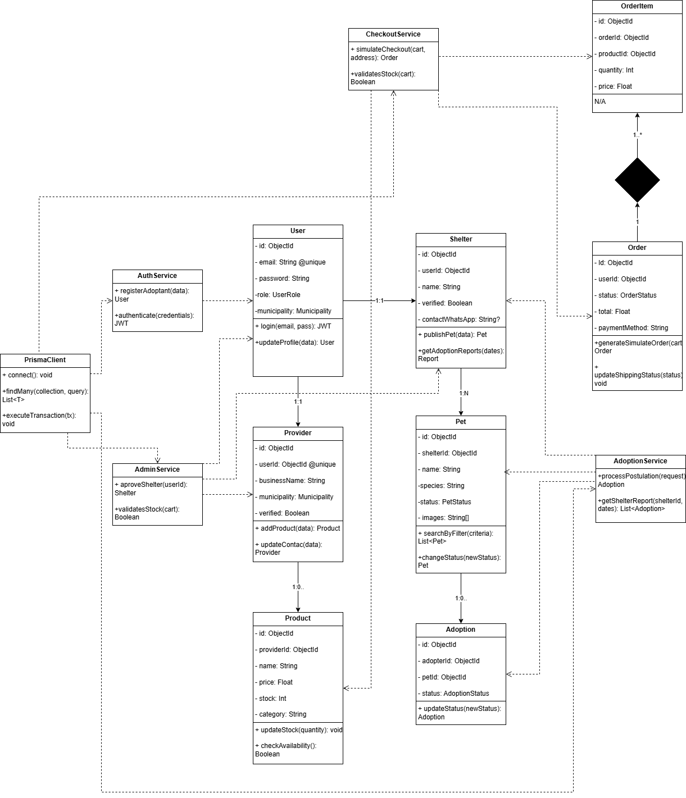
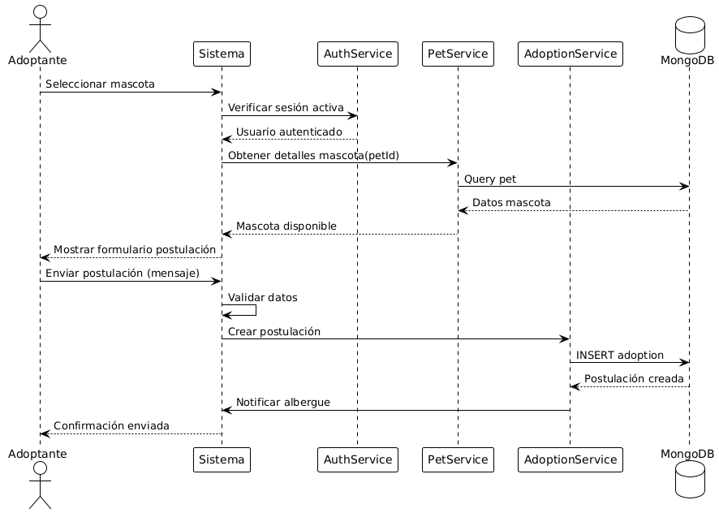
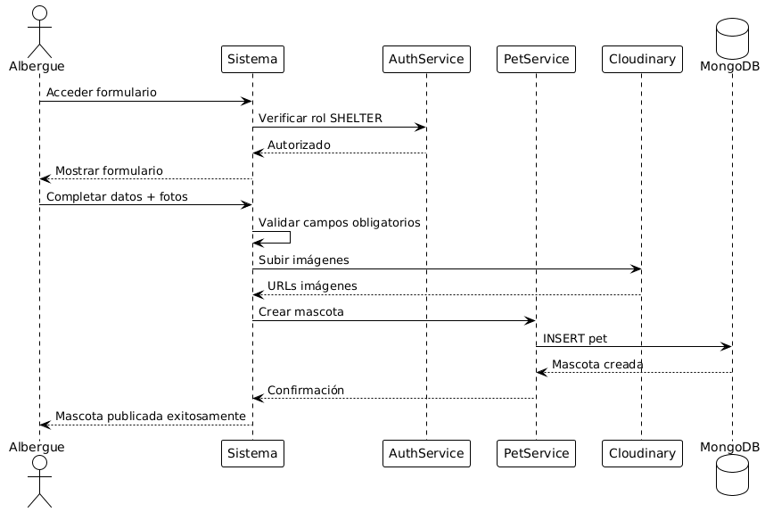
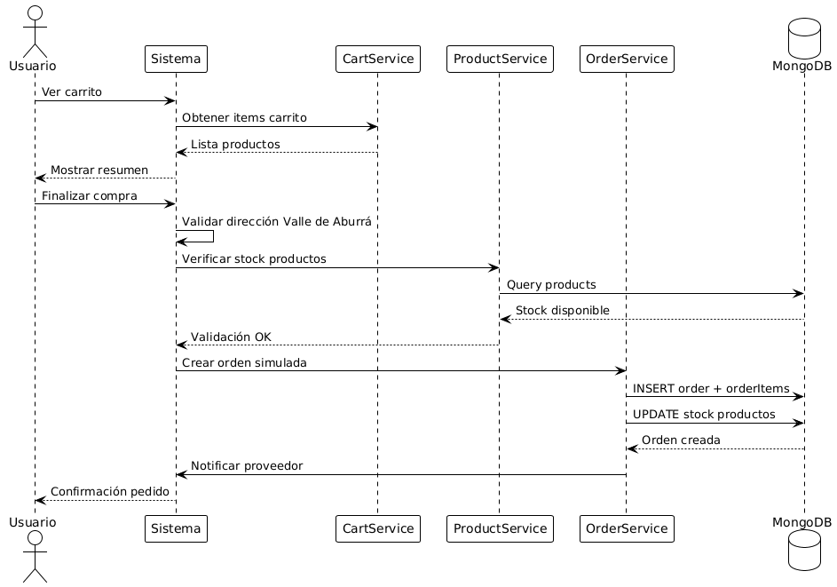
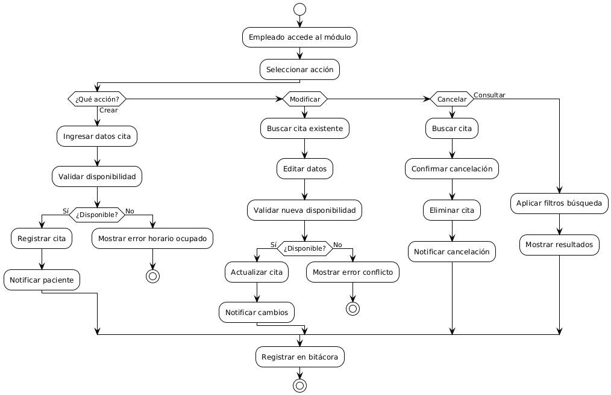
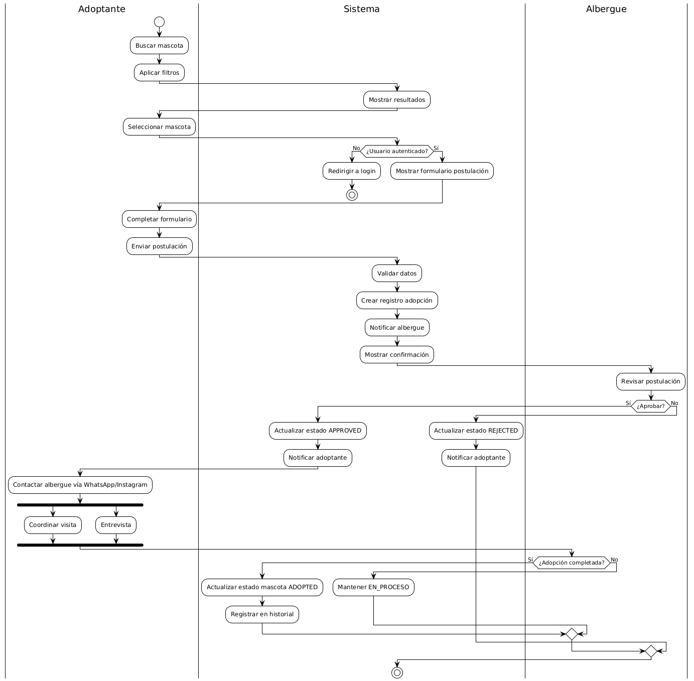

# Diagramas UML del Sistema

## Índice

1. Introducción
   &nbsp;&nbsp;&nbsp;&nbsp;Propósito del documento
   &nbsp;&nbsp;&nbsp;&nbsp;Herramienta utilizada
   &nbsp;&nbsp;&nbsp;&nbsp;Convenciones y Notación UML 2.5
2. Diagrama de Clases
3. Diagramas de Secuencia
4. Diagramas de Actividades
5. Diagramas de Estados (Opcional)
6. Diagrama de Comunicación (Opcional)
7. Diagrama de Objetos (Opcional)
8. Convenciones y Leyenda

---

## 1. Introducción

El presente documento contiene los **Diagramas UML** (_Unified Modeling Language_) que especifican la estructura y el comportamiento dinámico del sistema **PawLig**. Estos diagramas son el lenguaje estándar utilizado para visualizar, especificar y documentar sistemas de software.

### Propósito del documento

El objetivo principal es traducir los **requerimientos funcionales (RF)** y **no funcionales (RNF)** de la Fase 1 en especificaciones gráficas y técnicas que servirán como guía para el equipo de desarrollo durante la fase de implementación. Esta documentación es crítica para el trabajo de los arquitectos de software.

### Herramienta utilizada

[**Mencionar la herramienta utilizada**, por ejemplo: Draw.io, Lucidchart, o StarUML].

### Convenciones y Notación UML 2.5

Se utiliza la notación estandarizada **UML 2.5** para representar los elementos del sistema.

---

## 2. DIAGRAMA DE CLASES

El diagrama de clases representa la **estructura estática** del sistema. Detalla las clases, sus atributos, métodos y las relaciones estáticas entre ellas, siguiendo la estructura del Modelo Entidad-Relación (Documento 9).

**Requisitos mínimos**: Debe incluir entre **10 y 15 clases** del sistema.  
Cada clase debe incluir:

- Nombre de la clase
- Atributos (con visibilidad: `+` público, `-` privado, `#` protegido y tipos de datos)
- Métodos/Operaciones (con parámetros y tipo de retorno)

**Organización recomendada**: Las clases deben reflejar la arquitectura seleccionada (**Next.js Full-Stack Monolítico Modular**) y agruparse por responsabilidades, incluyendo:

- Capa de Presentación (Controladores/API Routes)
- Capa de Lógica de Negocio (Servicios/Entidades)
- Capa de Datos (Repositorios/Prisma Client)

**Relaciones a mostrar**: Asociación, Agregación, Composición, Herencia, Dependencia y Cardinalidad.

---

## 3. DIAGRAMAS DE SECUENCIA

Los diagramas de secuencia muestran la **interacción dinámica** entre los objetos y actores a lo largo del tiempo, representando el flujo de mensajes en una secuencia ordenada.

- **Postular adopción**

- **Publicar mascota**

- **Simular compra**

---

## 4. DIAGRAMAS DE ACTIVIDADES

Representan el **flujo de trabajo** o los algoritmos de procesos de negocio. Deben incluir la secuencia de actividades, decisiones y la responsabilidad de los actores mediante _"Swimlanes"_ o carriles.

- **Gestionar citas**

- **Adopción**

---

## 5. Convenciones y Leyenda

Explicación de símbolos y notación utilizada, especialmente las convenciones propias del proyecto (ej. cómo se representa la comunicación con servicios externos como Cloudinary).
